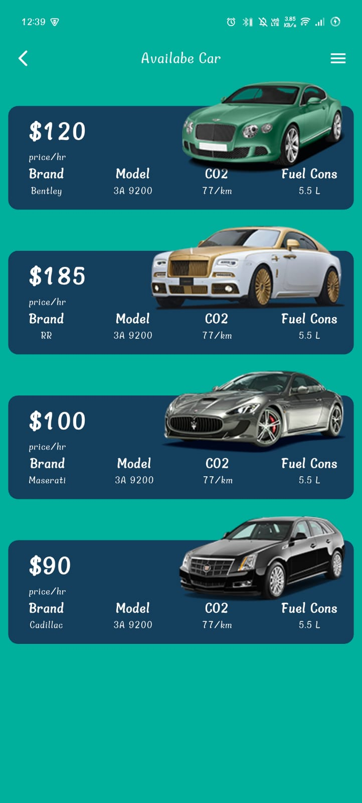
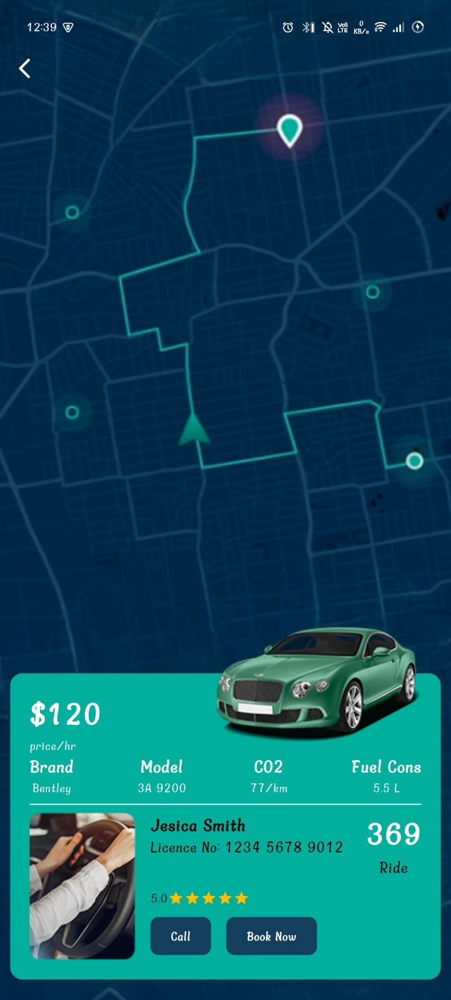

# 🚗 Car Rental App UI

A premium Car Rental App UI implementation in Flutter. This project demonstrates high-quality UI development with custom styling, smooth navigation, and a clean project structure.

## 📱 Implementation Preview

| Home Screen | Car Detail Screen |
|:---:|:---:|
|  |  |

## ✨ UI Features

- **Modern Aesthetic**: Clean, white-label design with custom coloring.
- **Custom Components**:
  - **Glassmorphism Cards**: Translucent backgrounds with rounded corners.
  - **Custom AppBar**: Minimalist navigation bar with custom icons.
  - **Information Layouts**: Structured `Row` and `Column` widgets for clear data presentation.
- **Visual Effects**:
  - **Hero Animations**: Seamless transition of the car image from Home to Detail screen.
  - **Background Integration**: Full-screen map background on the detail page.
- **Typography**: Bold, readable fonts with clear hierarchy (Price, Titles, Specs).

## 📂 Project Structure

A simple and organized folder structure focused on UI components:

```
lib/
├── core/             # Design constants (colors, styles)
├── data/             # Mock data for UI population
├── model/            # Data models
├── views/            # UI Screens
│   ├── widgets/      # Reusable UI widgets (e.g., CarItems)
│   ├── home_screen.dart
│   └── car_detail_screen.dart
└── main.dart         # App Entry Point
```

## 🛠️ Built With

- **Flutter**: Google's UI toolkit for building natively compiled applications.
- **Dart**: The programming language for Flutter.
- **Material Design**: Uses fundamental Material widgets (`Scaffold`, `Stack`, `Container`, `ListView`).


---
*Focus: UI Implementation & Styling*
